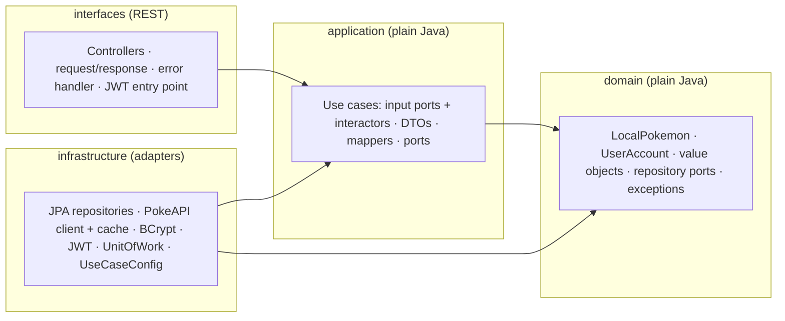
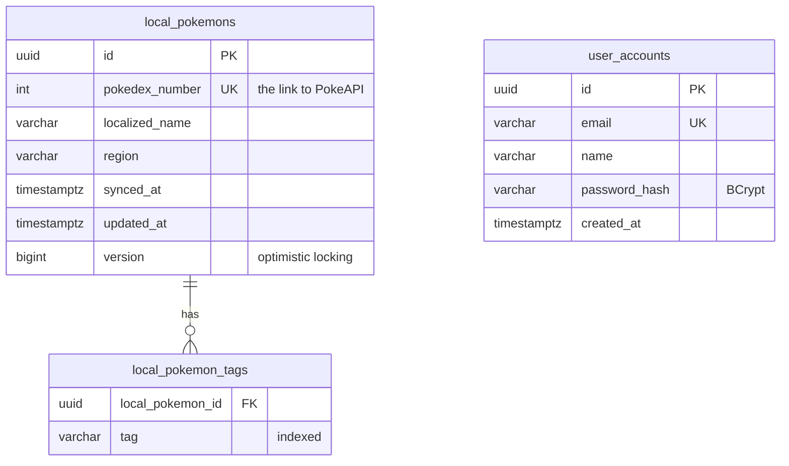

# Pokémon Catalog

A Pokémon catalog backed by [PokeAPI](https://pokeapi.co/). Anyone can browse Pokémon and open their
details. A signed-in user can **sync** a Pokémon into the organization's own PostgreSQL database and
enrich it with data PokeAPI doesn't have: a **localized name**, a **region** and **classification
tags**. Every screen shows one Pokémon: PokeAPI's data and ours, merged by the backend.

- **Backend:** Java 25 · Spring Boot 4.1 · Spring Security (JWT) · PostgreSQL 17 · Flyway · Caffeine
- **Frontend:** React 19 · TypeScript · Vite · React Router · TanStack Query
- **Quality:** Clean Architecture enforced by ArchUnit · TDD (unit + Testcontainers ITs) · zero console
  warnings

## Quick start

Requirements: Docker.

```bash
docker compose up --build
```

| What | Where |
|---|---|
| Web app | http://localhost:3000 |
| API | http://localhost:8080/api/v1 (health: `/actuator/health`) |
| API docs (Swagger UI) | http://localhost:8080/swagger-ui.html |
| PostgreSQL | `localhost:5433`, database and user `pokedex` |

### Demo account

| Email | Password |
|---|---|
| `demo@pokemon.com` | `Pikachu2026!` |

The database starts with demo data: this account and ten synced Pokémon (Bulbasaur, Charmander,
Charizard, Squirtle, Jigglypuff, Meowth, Psyduck, Gengar, Snorlax, Dragonite) with French localized
names, region and tags. Pikachu is left out on purpose, so it can be synced live.

### Try it

1. Browse the list: the seeded Pokémon show their localized name under the name.
2. Open Eevee: the evolution tree has eight branches.
3. Open Pikachu: a visitor sees the data and no controls. Sign in with the demo account.
4. **Sync to local database**, then **Edit**: localized name, region, tags (comma-separated).
   An invalid tag (`bad tag!`) is rejected with an explanation.
5. Back on the list, Pikachu's card already shows the new name.
6. **Remove** asks for confirmation; the Pokémon can then be synced again.

In Swagger UI, call `POST /auth/login`, then **Authorize** with the `accessToken` to try the protected
routes.

The defaults are for local use only. To override them, copy `.env.example` to `.env`.

## Architecture

The backend follows Clean Architecture strictly: dependencies point inward only, and `domain` and
`application` are plain Java, without Spring, JPA, Jackson or a logger. ArchUnit fails the build if
any rule is broken ([`LayeredArchitectureTest`](backend/src/test/java/dev/guilhermeds/backend/architecture/LayeredArchitectureTest.java)).



- **Use cases** are input-port interfaces implemented by `*Interactor` classes, wired in one
  composition root (`UseCaseConfig`). Controllers only know the interfaces.
- **Every data source is a repository port** in the domain: `PokemonRepository` (read-only, backed by
  PokeAPI), `LocalPokemonRepository` and `UserAccountRepository` (PostgreSQL). The domain never
  names PokeAPI.
- **The merge is a use case.** The detail and the list read PokeAPI and add our record; the list
  page asks the database for its 20 Pokémon in **one** query, tags included.
- **Transactions** are a port (`UnitOfWork`), so no `@Transactional` leaks into the use cases.
  PokeAPI is always called *before* a transaction opens.
- **Determinism:** business code never reads the clock or generates ids; both come from the edge.

### Data model



The local record keeps the Pokédex number and our own fields only: everything else, the name
included, always comes from PokeAPI, so nothing local can go stale. Local data belongs to the
organization; users exist to protect the writes. The schema is owned by Flyway migrations.

## API

Base path `/api/v1`. Every error has the same shape:
`{ "code": "...", "message": "...", "fieldErrors": [ { "field": "...", "message": "..." } ] }`.

| Method & path | Auth | Success | Errors |
|---|---|---|---|
| `GET /pokemon?page=0&size=20` | public | 200, a page of cards (with our localized name) | 400, 503 |
| `GET /pokemon/{name or number}` | public | 200, PokeAPI data + our record (`local`, `null` if not synced) | 400, 404, 503 |
| `GET /pokemon/{number}/local` | public | 200, our record | 400, 404, 503 |
| `POST /pokemon/{number}/local` | 🔒 | 201 + `Location`, the Pokémon is synced | 400, 401, 404, 409, 503 |
| `PUT /pokemon/{number}/local` | 🔒 | 200, our fields replaced | 400, 401, 404, 409, 503 |
| `DELETE /pokemon/{number}/local` | 🔒 | 204 | 400, 401, 404, 503 |
| `POST /auth/register` | public | 201, the account | 400, 409, 503 |
| `POST /auth/login` | public | 200, `{ accessToken, tokenType, expiresAt }` | 400, 401, 503 |
| `GET /auth/me` | 🔒 | 200, the account | 401 |

Notable statuses: **409** on a second sync of the same Pokémon and on an edit that crossed another
one (`@Version`); **503 `DATA_UNAVAILABLE`** within seconds when PokeAPI or the database can't be
reached; **400** for a malformed body, an invalid value (with the field when there is one) or a name
where a Pokédex number is expected. The full contract is in
[`docs/domain-model.md`](docs/domain-model.md#api-contract).

## Design decisions

Each choice is recorded with its context and alternatives in [`docs/decisions.md`](docs/decisions.md).
The main ones:

- **Strict Clean Architecture** with framework-free `domain` and `application`, enforced by ArchUnit
  (D-001, D-003).
- **One merged Pokémon resource**: reads are public and merge PokeAPI with our record; writes go to
  the `/local` sub-resource and need a token (D-030).
- **Only our fields are stored**; PokeAPI stays the source of truth (D-039). The `/local` routes take
  the Pokédex number, so editing our data works even while PokeAPI is down (D-040).
- **The domain is the single validation authority**; the edge only checks shape, with limits taken
  from the domain's constants (D-028).
- **Optimistic locking** against the managed entity: concurrent edits are a 409, not a lost update
  (D-011).
- **PokeAPI responses are cached** with Caffeine, in one place (D-012); page cards are fetched
  concurrently on virtual threads (D-018).
- **Stateless JWT** (HS256) with Spring Security's own JOSE support and BCrypt (D-008); public routes
  ignore the token, so an expired one never breaks a public page (D-036).
- **Frontend:** server state in TanStack Query, every write refreshes the detail and the cached list;
  design tokens and shared UI components from day one (D-021, D-034).

## Tests

```bash
cd backend
./gradlew test                         # unit tests + ArchUnit
./gradlew integrationTest              # integration tests (Testcontainers, needs Docker)
./gradlew check                        # everything + merged coverage report (build/reports/jacoco)

cd frontend
npm run lint && npm run typecheck && npm test -- --run && npm run build
```

- **TDD, inward-out:** domain (plain JUnit) → interactors (ports mocked) → adapters (real PostgreSQL
  via Testcontainers, the real HTTP stack via `@WebMvcTest`, recorded PokeAPI JSON). The history
  shows each step as its own commit: `test:` (red), `feat:` (green), `refactor:`.
- **Every endpoint has ITs** for success and each documented error status. Failure modes are
  tested for real: a stopped database container answers 503, a dead pooled connection too.
- **Frontend tests** use Vitest, Testing Library and MSW, and **fail on any console output**.

## Run locally (development)

Requirements: Docker (for PostgreSQL and the integration tests), Node 24. The JDK 25 toolchain is
downloaded by Gradle if it isn't installed.

```bash
docker compose up -d postgres          # database only, on localhost:5433

cd backend
./gradlew bootRun                      # API on :8080

cd frontend
npm install
npm run dev                            # app on :5173, /api proxied to :8080
```

## Project structure

```
backend/     Spring Boot API: src/main/java/dev/guilhermeds/backend/{domain,application,infrastructure,interfaces}
frontend/    React app: src/{app,features/{pokemon,auth},shared,test}
docs/        requirements, plan, decisions, domain model, standards, examples, AI log
docker-compose.yml
```

## Known limitations and next steps

- **No offline fallback:** with PokeAPI down, the merged reads answer 503; our own data stays
  readable and editable on `/pokemon/{number}/local`. Serving synced Pokémon offline would need a
  copy of PokeAPI's data, which was left out on purpose (D-039).
- **Stale browser tabs:** concurrent saves are caught (409), but an edit from a tab opened long ago
  isn't; sending the version with `If-Match` is the next step.
- **Search and filters** (by name, type or tag) aren't built; the `tag` column is indexed for it.
- **Tokens** live in `sessionStorage` and expire; there is no refresh token.
- **One localized name per Pokémon:** names per language would be a `(language, name)` table (D-027).

## How AI was used

The developer led this project from start to finish and used an AI coding agent as the
implementer. The developer set the direction: the architecture and how strictly it is enforced, the
engineering rules in [`AGENTS.md`](AGENTS.md) and [`docs/standards/`](docs/standards/), the product
vision, the scope (cutting what the requirements didn't ask for) and the order of the work, slice by
slice. Along the way the developer proposed designs, challenged the agent's, and made the calls,
from treating PokeAPI as just another repository to what the screens show; when the agent was asked
for options, the developer chose among them or replaced them. [`docs/decisions.md`](docs/decisions.md)
records the reasoning behind each choice.

The agent wrote most of the code and tests under those rules (TDD one test at a time, ask before
adding a dependency or changing the API contract, verify external facts instead of guessing), and
nothing was committed before the developer had read it.

[`docs/ai-log.md`](docs/ai-log.md) records the moments that mattered: AI output that was corrected
or rejected, defects caught by tests, ArchUnit or a look in the browser, and assumptions that
turned out wrong on verification. [`docs/genai-case-study.md`](docs/genai-case-study.md) holds a
separate exercise: generating a task-management API with AI, then validating and correcting the
output.
